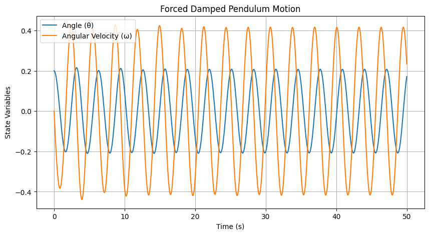

# Problem 2
# Theoretical Foundation: Forced Damped Pendulum

### 1. Governing Equation

The motion of a **forced damped pendulum** is described by:

$$
\frac{d^2\theta}{dt^2} + b \frac{d\theta}{dt} + \frac{g}{L} \sin\theta = A \cos(\omega t)
$$

where:
- $b$ is the damping coefficient,
- $g/L$ represents the natural oscillation frequency,
- $A \cos(\omega t)$ is the external periodic force.

### 2. Small-Angle Approximation

For small angles ($\theta \approx 0$), we use the approximation $\sin\theta \approx \theta$, simplifying the equation to:

$$
\frac{d^2\theta}{dt^2} + b \frac{d\theta}{dt} + \frac{g}{L} \theta = A \cos(\omega t)
$$

This reduces the system to a **linear differential equation**, which can be solved analytically.

### 3. Resonance and Energy Implications

- **Natural Frequency:**  
  $$
  \omega_0 = \sqrt{g/L}
  $$
- **Resonance Condition:**  
  When the driving frequency $\omega$ matches $\omega_0$, the system experiences **resonance**, leading to **large oscillations**.
- **Damping Effects:**  
  Higher damping ($b$) reduces oscillation amplitude and prevents unbounded energy growth.


# Analysis of Dynamics

### 1. Influence of Parameters on Motion

The behavior of the **forced damped pendulum** depends on key parameters:

1. **Damping Coefficient ($b$)**  
   - Higher damping reduces oscillations and eventually brings the pendulum to rest.  
   - Lower damping allows sustained motion and can lead to resonance effects.  

2. **Driving Amplitude ($A$)**  
   - Small $A$ results in steady periodic motion.  
   - Large $A$ can induce irregular motion, leading to chaotic behavior.  

3. **Driving Frequency ($\omega$)**  
   - When $\omega \approx \omega_0$ (natural frequency), resonance occurs, amplifying oscillations.  
   - At non-resonant frequencies, motion remains stable but varies in amplitude.  

### 2. Transition from Regular to Chaotic Motion

- At **low driving forces**, the pendulum follows predictable periodic motion.  
- Increasing $A$ or adjusting $\omega$ can introduce **nonlinear effects**, where motion becomes **quasi-periodic** or **chaotic**.  
- **Chaotic motion** means small differences in initial conditions lead to drastically different trajectories, making long-term prediction impossible.  

### 3. **Physical Interpretation**
- **Regular motion** is seen in **clocks and metronomes** where precise oscillations are required.  
- **Chaotic behavior** appears in **weather systems, electrical circuits, and biological rhythms**, where nonlinearity dominates.  


# Practical Applications of the Forced Damped Pendulum

The **forced damped pendulum** model has widespread applications in engineering, physics, and real-world systems. Below are some key areas where it plays a crucial role:

### 1. Energy Harvesting Devices  
- **Example:** Piezoelectric energy harvesters convert oscillations into electrical power.  
- The pendulum’s motion can be used to generate electricity in **wearable sensors**, **self-powered devices**, and **vibrational energy systems**.  

### 2. Suspension Bridges  
- Bridges experience oscillations due to **wind forces** and **traffic loads**.  
- If the forcing frequency matches the bridge’s natural frequency (**resonance**), it can cause **dangerous oscillations** (e.g., Tacoma Narrows Bridge collapse).  
- Engineers use **damping mechanisms** to prevent excessive movement.  

### 3. Oscillating Electrical Circuits (RLC Circuits)  
- The forced damped pendulum is analogous to **RLC circuits** in electronics.  
- In an RLC circuit:
  - **Damping ($b$)** corresponds to electrical resistance.
  - **Natural frequency ($\omega_0$)** depends on inductance and capacitance.
  - **Driving force ($A \cos(\omega t)$)** represents an AC voltage source.  
- Understanding this analogy helps in designing **filters, oscillators, and signal-processing devices**.  

### 4. Human Movement and Biomechanics  
- **Example:** The human gait involves periodic motion controlled by muscles and external forces.  
- **Rehabilitation therapy** and **prosthetic limb design** apply the principles of forced oscillations.  

### **Conclusion**
The forced damped pendulum isn’t just a theoretical concept—it plays a vital role in **engineering, biomechanics, and energy systems**. Understanding these dynamics allows us to improve **stability, efficiency, and safety** in various real-world applications. 🚀


# Implementation: Simulating the Forced Damped Pendulum

We implement a numerical simulation of the **forced damped pendulum** using Python. The motion is governed by:

$$
\frac{d^2\theta}{dt^2} + b \frac{d\theta}{dt} + \frac{g}{L} \sin\theta = A \cos(\omega t)
$$

where:
- $b$ is the damping coefficient,
- $A \cos(\omega t)$ is the external driving force,
- $g/L$ represents the natural oscillation frequency.

### 1. **Numerical Simulation (Runge-Kutta Method)**

```python
import numpy as np
import matplotlib.pyplot as plt
from scipy.integrate import solve_ivp

# Define the differential equation
def pendulum(t, state, b, A, omega, g, L):
    theta, omega_dot = state
    dtheta_dt = omega_dot
    domega_dt = -b * omega_dot - (g / L) * np.sin(theta) + A * np.cos(omega * t)
    return [dtheta_dt, domega_dt]

# Parameters
b = 0.2   # Damping coefficient
A = 1.2   # Driving force amplitude
omega = 2.0  # Driving frequency
g = 9.81  # Gravity
L = 1.0   # Pendulum length
theta0 = 0.2  # Initial angle
omega0 = 0.0  # Initial angular velocity
t_span = (0, 50)  # Time interval
t_eval = np.linspace(*t_span, 1000)

# Solve ODE using Runge-Kutta method
sol = solve_ivp(pendulum, t_span, [theta0, omega0], args=(b, A, omega, g, L), t_eval=t_eval)

# Plot the pendulum's motion over time
plt.figure(figsize=(10, 5))
plt.plot(sol.t, sol.y[0], label="Angle (θ)")
plt.plot(sol.t, sol.y[1], label="Angular Velocity (ω)")
plt.xlabel("Time (s)")
plt.ylabel("State Variables")
plt.title("Forced Damped Pendulum Motion")
plt.legend()
plt.grid()
plt.show()
```



### 2. **Phase Space Diagram**

The phase space plot shows how the system evolves over time, highlighting periodic or chaotic motion.

```python
plt.figure(figsize=(6, 6))
plt.plot(sol.y[0], sol.y[1], color='red')
plt.xlabel("Angle (θ)")
plt.ylabel("Angular Velocity (ω)")
plt.title("Phase Space Diagram")
plt.grid()
plt.show()
```

### 3. **Poincaré Section (Chaos Analysis)**

A Poincaré section helps visualize transitions from regular to chaotic behavior by plotting states at fixed time intervals.

```python
times = np.arange(0, 50, 2*np.pi/omega)  # Strobe at the driving frequency
theta_poincare = np.interp(times, sol.t, sol.y[0])
omega_poincare = np.interp(times, sol.t, sol.y[1])

plt.figure(figsize=(6, 6))
plt.scatter(theta_poincare, omega_poincare, color='blue', s=5)
plt.xlabel("Angle (θ)")
plt.ylabel("Angular Velocity (ω)")
plt.title("Poincaré Section")
plt.grid()
plt.show()
```