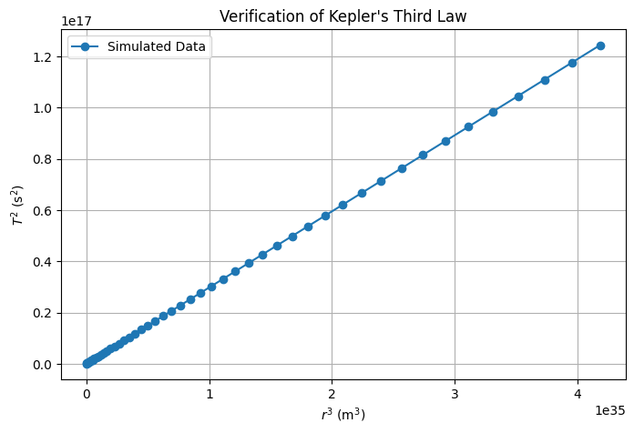

# Problem 1
# **Orbital Period and Radius: Kepler's Third Law**

## **Task 1. Derivation of Kepler’s Third Law**

For a small object orbiting a much larger central body in a **circular orbit**, the **gravitational force** provides the necessary **centripetal force**:

$$
F_{\text{gravity}} = F_{\text{centripetal}}
$$

$$
\frac{G M m}{r^2} = \frac{m v^2}{r}
$$

- $G$ : Gravitational constant  
- $M$ : Mass of the central body  
- $m$ : Mass of the orbiting object  
- $r$ : Orbital radius  
- $v$ : Orbital velocity  

Cancelling $m$ and solving for velocity:

$$
v = \sqrt{\frac{G M}{r}}
$$

The orbital period $T$ is the time to complete one full orbit:

$$
T = \frac{\text{circumference}}{\text{velocity}} = \frac{2\pi r}{v}
$$

Substituting $v$:

$$
T = \frac{2\pi r}{\sqrt{\frac{G M}{r}}}
$$

Squaring both sides:

$$
T^2 = \frac{4\pi^2 r^3}{G M}
$$

This shows that:

$$
T^2 \propto r^3
$$

which is **Kepler’s Third Law**—the square of the orbital period is proportional to the cube of the orbital radius.


## **Task 2. Implications of Kepler’s Third Law in Astronomy**

### **1. Calculating Planetary Masses**
Kepler’s Third Law states:

$$
T^2 = \frac{4\pi^2 r^3}{G M}
$$

Rearranging to solve for the mass of the central body:

$$
M = \frac{4\pi^2 r^3}{G T^2}
$$

This allows astronomers to determine the mass of a **star, planet, or moon** by measuring the orbital period $T$ and radius $r$ of an orbiting object.  

- Example: The mass of the **Sun** can be calculated using Earth's orbital data.  
- Used to estimate the **mass of exoplanets** by analyzing their effect on nearby objects.

### **2. Measuring Distances in Space**
If the mass $M$ is known, the equation:

$$
r^3 \propto T^2
$$

can be used to **calculate the distance** of an orbiting body when the period $T$ is observed.  

- Helps determine the **distances of moons around planets**.  
- Essential for **mapping planetary systems** and **calculating exoplanet orbits**.

### **3. Applications in Modern Astronomy**
- **Exoplanet Discovery**: Detecting distant planets by observing how their gravitational pull affects the motion of nearby stars.  
- **Galaxy Mass Estimation**: Using orbital speeds of stars to infer the mass distribution of galaxies.  
- **Satellite Navigation**: Ensuring stable orbits for artificial satellites and space missions.


## **Task 3. Real-World Examples of Kepler’s Third Law**

### **1. The Moon’s Orbit Around Earth**
The Moon follows a nearly circular orbit around Earth. Using Kepler’s Third Law:

$$
T^2 = \frac{4\pi^2 r^3}{G M}
$$

we can verify that the Moon’s **orbital period** ($T \approx 27.3$ days) and **orbital radius** ($r \approx 3.84 \times 10^8$ m) are consistent with Earth's mass ($M = 5.97 \times 10^{24}$ kg).

#### **Key Insights:**
- Confirms Earth's gravitational influence on the Moon.
- Helps predict lunar positions for astronomy and navigation.
- Useful in **space missions**, such as Apollo landings and satellite positioning.

### **2. Planetary Orbits in the Solar System**
For planets orbiting the Sun, Kepler’s Third Law simplifies to:

$$
T^2 \propto r^3
$$

This allows astronomers to **predict planetary distances** based on their orbital periods.

#### **Example: Earth vs. Mars**
- Earth: $T = 1$ year, $r = 1$ AU (astronomical unit).
- Mars: $T \approx 1.88$ years.
- Applying Kepler’s Third Law:

  $$
  r^3 = T^2 \Rightarrow r = \sqrt[3]{(1.88)^2} \approx 1.52 \text{ AU}
  $$

which matches Mars’ actual orbit.

#### **Key Applications:**
- **Planetary exploration**: Calculating transfer orbits for space probes.
- **Orbital predictions**: Understanding gravitational interactions.
- **Exoplanet studies**: Inferring distances of newly discovered planets.

### **3. Practical Use in Astronomy and Space Science**
- **GPS Satellites**: Kepler’s Law ensures satellites maintain stable orbits.
- **Space Missions**: NASA and ESA use it for interplanetary travel.
- **Binary Star Systems**: Helps determine masses and distances of stars.

Kepler’s Third Law provides a **powerful framework** to study celestial mechanics, from **our Moon’s motion** to **planetary orbits** and even **distant exoplanets**.


## **Task 4. Computational Simulation of Circular Orbits**

### **1. Objective**
This simulation models a **circular orbit** using Newton’s laws and verifies **Kepler’s Third Law** ($T^2 \propto r^3$).

### **2. Python Implementation**
The code below simulates a planet orbiting a star and plots its trajectory while verifying the period-radius relationship.

```python
import numpy as np
import matplotlib.pyplot as plt
from scipy.constants import G

# Constants
M_sun = 1.989e30  # Mass of the Sun (kg)
AU = 1.496e11  # 1 Astronomical Unit (m)
year = 3.154e7  # 1 year in seconds

# Function to compute orbital period
def orbital_period(radius, mass=M_sun):
    return 2 * np.pi * np.sqrt(radius**3 / (G * mass))

# Generate radius values (0.4 AU to 5 AU)
radii = np.linspace(0.4 * AU, 5 * AU, 50)
periods = np.array([orbital_period(r) for r in radii])

# Verify Kepler's Law (T^2 vs. r^3)
plt.figure(figsize=(8, 5))
plt.plot(radii**3, periods**2, 'o-', label="Simulated Data")
plt.xlabel("$r^3$ (m$^3$)")
plt.ylabel("$T^2$ (s$^2$)")
plt.title("Verification of Kepler's Third Law")
plt.legend()
plt.grid()
plt.show()
```



