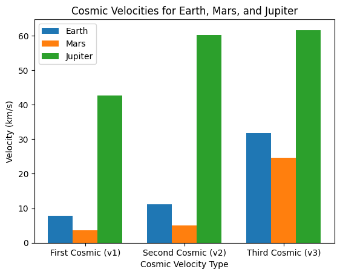

# Problem 2
# **Task 1. Cosmic Velocities: Definitions and Meanings**

## **1. First Cosmic Velocity (Orbital Velocity)**

The **first cosmic velocity** is the **minimum velocity** required for an object to stay in a **stable circular orbit** around a celestial body. It is given by:

$$
v_1 = \sqrt{\frac{G M}{R}}
$$

- **$G$**: Gravitational constant ($6.674 \times 10^{-11} \, \text{m}^3 \text{kg}^{-1} \text{s}^{-2}$)
- **$M$**: Mass of the celestial body
- **$R$**: Radius from the center of the celestial body

🔹 **Example**: A satellite in **low Earth orbit** (~300 km altitude) moves at **~7.9 km/s**.

---

## **2. Second Cosmic Velocity (Escape Velocity)**
The **second cosmic velocity** is the **minimum velocity** needed to **break free** from a planet's gravity **without further propulsion**. It is derived from energy conservation:

$$
v_2 = \sqrt{\frac{2 G M}{R}}
$$

🔹 **Example**: Earth’s **escape velocity** is **~11.2 km/s**.

- **If $v < v_2$**: The object falls back.
- **If $v = v_2$**: The object reaches infinity but with zero velocity.
- **If $v > v_2$**: The object moves into **hyperbolic orbit**.

---

## **3. Third Cosmic Velocity (Solar System Escape Velocity)**
The **third cosmic velocity** is the **minimum speed** needed to escape the **Sun’s gravitational field** from Earth’s orbit. It is given by:

$$
v_3 = \sqrt{v_2^2 + v_{\text{orb}}^2}
$$

where:
- **$v_2$** is Earth’s escape velocity **(11.2 km/s)**.
- **$v_{\text{orb}}$** is Earth's orbital speed **(29.8 km/s)**.

🔹 **Example**: The **third cosmic velocity** from Earth is **~42.1 km/s**, used by interstellar missions like **Voyager 1 & 2**.

---

## **4. Summary of Cosmic Velocities**
| Cosmic Velocity | Meaning | Formula | Example (Earth) |
|-----------------|---------|---------|----------------|
| **First ($v_1$)** | Orbiting velocity | $\sqrt{G M / R}$ | **7.9 km/s** |
| **Second ($v_2$)** | Escape velocity | $\sqrt{2 G M / R}$ | **11.2 km/s** |
| **Third ($v_3$)** | Solar escape velocity | $\sqrt{v_2^2 + v_{\text{orb}}^2}$ | **42.1 km/s** |


# **Task 2. Mathematical Analysis of Cosmic Velocities**

## **1. First Cosmic Velocity ($v_1$) – Orbital Velocity**
The first cosmic velocity is derived from the **centripetal force equation**:

$$
F_c = \frac{m v_1^2}{R}
$$

which must balance the **gravitational force**:

$$
F_g = \frac{G M m}{R^2}
$$

Setting $F_c = F_g$:

$$
\frac{m v_1^2}{R} = \frac{G M m}{R^2}
$$

Canceling **$m$** and solving for $v_1$:

$$
v_1 = \sqrt{\frac{G M}{R}}
$$

### **Parameters Affecting $v_1$**
- **Mass ($M$) of the celestial body**: Higher mass increases velocity.
- **Radius ($R$) of orbit**: Higher altitude lowers velocity.

🔹 **Example**: A satellite in **low Earth orbit (~300 km)** moves at **7.9 km/s**.

---

## **2. Second Cosmic Velocity ($v_2$) – Escape Velocity**
Derived from **energy conservation**:

- **Kinetic Energy at launch**:  
  $$
  KE = \frac{1}{2} m v_2^2
  $$
- **Gravitational Potential Energy**:  
  $$
  PE = -\frac{G M m}{R}
  $$

For escape, total energy must be **zero**:

$$
\frac{1}{2} m v_2^2 - \frac{G M m}{R} = 0
$$

Solving for $v_2$:

$$
v_2 = \sqrt{\frac{2 G M}{R}}
$$

### **Parameters Affecting $v_2$**
- **Mass ($M$)**: Higher mass increases escape velocity.
- **Radius ($R$)**: A larger radius decreases escape velocity.

🔹 **Example**: **Earth’s escape velocity** = **11.2 km/s**.

---

## **3. Third Cosmic Velocity ($v_3$) – Solar System Escape Velocity**
To **leave the Solar System**, an object must escape **both Earth's gravity and the Sun's gravity**. The total velocity required is:

$$
v_3 = \sqrt{v_2^2 + v_{\text{orb}}^2}
$$

where:
- $v_2$ = **Earth’s escape velocity (11.2 km/s)**
- $v_{\text{orb}}$ = **Earth’s orbital speed (29.8 km/s)**

### **Parameters Affecting $v_3$**
- **Sun’s gravity**: A stronger gravitational pull increases $v_3$.
- **Initial position**: The farther from the Sun, the lower the required $v_3$.

🔹 **Example**: **Voyager 1** achieved **~42.1 km/s** to escape the Solar System.

---

## **4. Summary of Velocity Dependence**
| Velocity | Formula | Mass ($M$) | Radius ($R$) | Orbital Speed ($v_{\text{orb}}$) |
|----------|---------|------------|--------------|-----------------|
| **First ($v_1$)** | $\sqrt{G M / R}$ | 🔼 Increases | 🔽 Decreases | ❌ Not required |
| **Second ($v_2$)** | $\sqrt{2 G M / R}$ | 🔼 Increases | 🔽 Decreases | ❌ Not required |
| **Third ($v_3$)** | $\sqrt{v_2^2 + v_{\text{orb}}^2}$ | 🔼 Increases | 🔽 Decreases | 🔼 Increases |

---


# **Task 3. Calculation and Visualization of Cosmic Velocities for Different Planets**

## **1. Introduction**
The first, second, and third cosmic velocities depend on the mass and radius of celestial bodies. We calculate these velocities for Earth, Mars, and Jupiter and visualize the differences.

---

## **2. Formulas for Cosmic Velocities**
Using the universal gravitational constant:

$$
G = 6.674 \times 10^{-11} \, \text{m}^3\text{kg}^{-1}\text{s}^{-2}
$$

- **First Cosmic Velocity (Orbital Velocity):**
  $$
  v_1 = \sqrt{\frac{G M}{R}}
  $$

- **Second Cosmic Velocity (Escape Velocity):**
  $$
  v_2 = \sqrt{\frac{2 G M}{R}}
  $$

- **Third Cosmic Velocity (Solar System Escape):**
  $$
  v_3 = \sqrt{v_2^2 + v_{\text{orb}}^2}
  $$

where:
- $M$ = mass of the celestial body,
- $R$ = radius of the celestial body,
- $v_{\text{orb}}$ = orbital velocity of the planet around the Sun.

---

## **3. Python Code for Calculations and Visualization**

```python
import numpy as np
import matplotlib.pyplot as plt

# Constants
G = 6.674e-11  # Gravitational constant (m³/kg/s²)

# Data for Earth, Mars, and Jupiter (mass in kg, radius in m, orbital velocity in m/s)
planets = {
    "Earth":  {"M": 5.972e24, "R": 6.371e6, "v_orb": 2.978e4},
    "Mars":   {"M": 6.417e23, "R": 3.389e6, "v_orb": 2.41e4},
    "Jupiter":{"M": 1.898e27, "R": 6.9911e7, "v_orb": 1.307e4},
}

# Calculate velocities
velocities = {}
for planet, data in planets.items():
    M, R, v_orb = data["M"], data["R"], data["v_orb"]
    v1 = np.sqrt(G * M / R)  # First cosmic velocity
    v2 = np.sqrt(2 * G * M / R)  # Second cosmic velocity
    v3 = np.sqrt(v2**2 + v_orb**2)  # Third cosmic velocity
    velocities[planet] = [v1, v2, v3]

# Convert to km/s
for planet, v in velocities.items():
    velocities[planet] = [round(v_i / 1000, 2) for v_i in v]

# Print results
print("Cosmic Velocities (km/s):")
for planet, v in velocities.items():
    print(f"{planet}: v1 = {v[0]} km/s, v2 = {v[1]} km/s, v3 = {v[2]} km/s")

# Visualization
labels = ["First Cosmic (v1)", "Second Cosmic (v2)", "Third Cosmic (v3)"]
x = np.arange(len(labels))
width = 0.25

fig, ax = plt.subplots()
for i, planet in enumerate(planets.keys()):
    ax.bar(x + i * width, velocities[planet], width, label=planet)

ax.set_xlabel("Cosmic Velocity Type")
ax.set_ylabel("Velocity (km/s)")
ax.set_title("Cosmic Velocities for Earth, Mars, and Jupiter")
ax.set_xticks(x + width)
ax.set_xticklabels(labels)
ax.legend()
plt.show()
```
Cosmic Velocities (km/s):
Earth: $v1 = 7.91 km/s$, $v2 = 11.19 km/s$, $v3 = 31.81 km/s$
Mars: $v1 = 3.55 km/s$, $v2 = 5.03 km/s$, $v3 = 24.62 km/s$
Jupiter: $v1 = 42.57 km/s$, $v2 = 60.2 km/s$, $v3 = 61.6 km/s$




