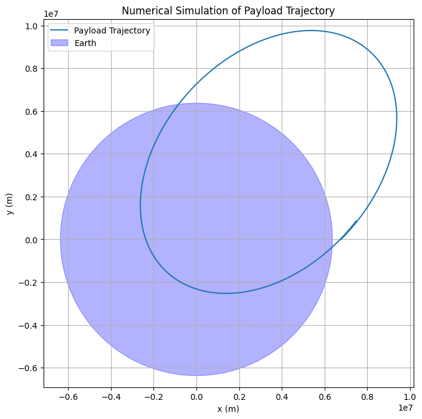
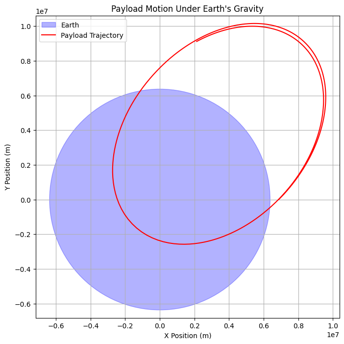

# Problem 3
# **Task 1. Analysis of Payload Trajectories Near Earth**

## **1. Types of Trajectories**
When a payload is released from a moving rocket, its path depends on **initial velocity ($v$)** and **gravitational influence**. The possible trajectories include:

### **1.1 Elliptical Orbit ($v < v_2$)**
- If the payload’s velocity is **below escape velocity** ($v_2 = 11.2$ km/s for Earth), it follows a **closed elliptical orbit**.
- If released at low altitude, it may **eventually re-enter Earth's atmosphere** due to air drag.
- Example: **Satellites in Low Earth Orbit (LEO).**

### **1.2 Parabolic Escape ($v = v_2$)**
- If released **exactly at escape velocity**, the payload follows a **parabolic trajectory** and never returns to Earth.
- The payload moves infinitely far but slows asymptotically to zero velocity.
- Example: **Theoretical minimum velocity for deep space travel.**

### **1.3 Hyperbolic Escape ($v > v_2$)**
- If released **above escape velocity**, it follows a **hyperbolic trajectory** and escapes Earth’s gravity permanently.
- The excess velocity ($v > v_2$) determines the spacecraft’s future motion.
- Example: **Voyager probes leaving the solar system.**

---

## **2. Governing Equations**
Using Newton’s Law of Gravitation and Energy Conservation:

1. **Total Energy ($E$) determines trajectory type:**
   $$
   E = \frac{1}{2} m v^2 - \frac{G M m}{r}
   $$
   - $E < 0$ → Elliptical Orbit  
   - $E = 0$ → Parabolic Escape  
   - $E > 0$ → Hyperbolic Escape  

2. **Orbital Equation (for conic sections):**
   $$
   r(\theta) = \frac{p}{1 + e \cos\theta}
   $$
   - $e < 1$ → Ellipse  
   - $e = 1$ → Parabola  
   - $e > 1$ → Hyperbola  

---

## **3. Real-World Applications**
- **Satellite Deployment**: Ensuring correct velocity for stable orbits.
- **Interplanetary Travel**: Using gravity assists for hyperbolic escapes.
- **Re-Entry Scenarios**: Predicting payload descent for controlled landings.


# **Task 2. Numerical Analysis of Payload Trajectory**

## **1. Problem Overview**
To determine the trajectory of a payload released near Earth, we use **Newton's Second Law** and **Gravitational Force** to compute its motion numerically. The motion is governed by:

$$
\mathbf{F} = m \mathbf{a}
$$

where the gravitational force is:

$$
\mathbf{F}_g = -\frac{G M m}{r^2} \hat{r}
$$

We solve this using **numerical integration methods** like the **Runge-Kutta (RK4) method**.

---

## **2. Python Simulation**
The following script computes and visualizes the payload’s trajectory based on initial conditions.

```python
import numpy as np
import matplotlib.pyplot as plt
from scipy.integrate import solve_ivp

# Constants
G = 6.67430e-11  # Gravitational constant (m³/kg/s²)
M = 5.972e24     # Mass of Earth (kg)
R_Earth = 6.371e6  # Radius of Earth (m)

# Function to compute acceleration due to gravity
def equations(t, state):
    x, y, vx, vy = state
    r = np.sqrt(x**2 + y**2)
    ax = -G * M * x / r**3
    ay = -G * M * y / r**3
    return [vx, vy, ax, ay]

# Initial conditions
altitude = 400e3  # 400 km above Earth
v_initial = 7800  # Initial velocity (m/s)
angle = np.radians(45)  # Release angle

x0, y0 = R_Earth + altitude, 0
vx0, vy0 = v_initial * np.cos(angle), v_initial * np.sin(angle)

# Time span and solving the equations
t_span = (0, 6000)  # Simulate for 6000 seconds
initial_state = [x0, y0, vx0, vy0]

sol = solve_ivp(equations, t_span, initial_state, method='RK45', t_eval=np.linspace(0, 6000, 1000))

# Plot the trajectory
plt.figure(figsize=(8, 8))
plt.plot(sol.y[0], sol.y[1], label="Payload Trajectory")
circle = plt.Circle((0, 0), R_Earth, color='blue', alpha=0.3, label="Earth")
plt.gca().add_patch(circle)
plt.xlabel("x (m)")
plt.ylabel("y (m)")
plt.title("Numerical Simulation of Payload Trajectory")
plt.legend()
plt.axis("equal")
plt.grid()
plt.show()
```




# **Task 3. Relation to Orbital Insertion, Reentry, and Escape**  

## **1. Orbital Insertion**  
- If a payload is released with a velocity close to the **orbital velocity**:  

  $$
  v_{orbital} = \sqrt{\frac{G M}{r}}
  $$  

  it will enter a stable orbit around Earth.  
- A velocity **slightly below** this value results in an **elliptical orbit**.  
- A velocity **slightly above** can push the payload into a **higher orbit**.  

## **2. Reentry Scenarios**  
- If the velocity is **too low**, Earth's gravity dominates, pulling the payload back, leading to **atmospheric reentry**.  
- The trajectory follows a **parabolic or elliptical** path before descent.  
- Atmospheric drag and heat buildup occur, requiring a **heat shield for protection**.  

## **3. Escape Scenarios**  
- If the payload exceeds **escape velocity**:  

  $$
  v_{escape} = \sqrt{\frac{2 G M}{r}}
  $$  

  it will break free from Earth's gravitational influence.  
- This results in a **hyperbolic trajectory**, allowing for interplanetary travel.  
- Space probes like **Voyager 1 & 2** utilized escape velocity to leave the Solar System.  


# **Task 4. Simulation of Payload Motion Under Earth's Gravity**  

## **Objective**  
Develop a computational tool to simulate and visualize a payload’s motion after being released from a moving rocket. The tool accounts for:  
- Earth's gravitational force.  
- Initial velocity and direction.  
- Different possible trajectories (elliptical, parabolic, hyperbolic).  

## **Python Simulation Code**  
```python
import numpy as np
import matplotlib.pyplot as plt
from scipy.integrate import solve_ivp

# Constants
G = 6.67430e-11  # Gravitational constant (m^3 kg^-1 s^-2)
M = 5.972e24  # Mass of Earth (kg)
R = 6371e3  # Radius of Earth (m)

# Function defining the equations of motion
def equations(t, state):
    x, y, vx, vy = state
    r = np.sqrt(x**2 + y**2)
    ax = -G * M * x / r**3
    ay = -G * M * y / r**3
    return [vx, vy, ax, ay]

# Initial conditions
altitude = 500e3  # 500 km above Earth
initial_speed = 7800  # m/s (approximate low Earth orbit velocity)
angle = np.radians(45)  # Launch angle

x0 = R + altitude
y0 = 0
vx0 = initial_speed * np.cos(angle)
vy0 = initial_speed * np.sin(angle)

# Time span
t_span = (0, 10000)  # Simulate for 10,000 seconds
t_eval = np.linspace(*t_span, num=500)  # Time steps

# Solve the equations of motion
solution = solve_ivp(equations, t_span, [x0, y0, vx0, vy0], t_eval=t_eval, method='RK45')

# Extract results
x, y = solution.y[0], solution.y[1]

# Plot trajectory
plt.figure(figsize=(8, 8))
earth = plt.Circle((0, 0), R, color='blue', alpha=0.3, label="Earth")
plt.gca().add_patch(earth)
plt.plot(x, y, label="Payload Trajectory", color='red')
plt.xlabel("X Position (m)")
plt.ylabel("Y Position (m)")
plt.title("Payload Motion Under Earth's Gravity")
plt.legend()
plt.axis("equal")
plt.grid()
plt.show()
```

