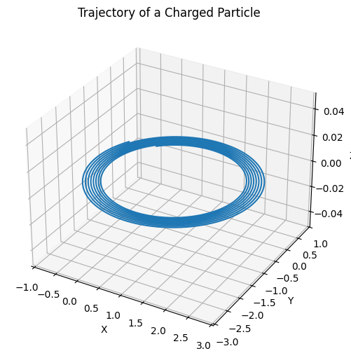

# Problem 1
# **1. Applications of the Lorentz Force**

## **Overview**

The Lorentz force describes how charged particles move in electric and magnetic fields:

$$
\vec{F} = q\vec{E} + q\vec{v} \times \vec{B}
$$

It's essential in many physics and engineering systems.

---

## **Key Applications**

### **Particle Accelerators**
- Use electric fields to accelerate particles.
- Magnetic fields steer them in circular paths (e.g., cyclotrons, synchrotrons).

### **Mass Spectrometers**
- Separate ions based on mass-to-charge ratio using magnetic deflection:

$$
r = \frac{mv}{qB}
$$

### **Plasma Confinement**
- Magnetic fields control hot plasma in fusion reactors (e.g., tokamaks).
- Charged particles follow spiral paths due to Lorentz force.

---

## **E and B Field Roles**
- **$\vec{E}$ field:** changes particle speed.
- **$\vec{B}$ field:** changes direction, not speed.

---


# **2.Simulating Particle Motion Under Lorentz Force**

## **Overview**

The Lorentz force governs the motion of charged particles:

$$
\vec{F} = q(\vec{E} + \vec{v} \times \vec{B})
$$

We simulate this using the **Euler method**, updating velocity and position step-by-step.

---

## **Python Simulation (Euler Method)**

```python
import numpy as np
import matplotlib.pyplot as plt

# Constants
q = 1.0     # Charge (C)
m = 1.0     # Mass (kg)
dt = 0.01   # Time step (s)
T = 50      # Total simulation time
steps = int(T / dt)

# Initial conditions
r = np.zeros((steps, 3))  # Position [x, y, z]
v = np.zeros((steps, 3))  # Velocity [vx, vy, vz]
r[0] = [0.0, 0.0, 0.0]
v[0] = [1.0, 1.0, 0.0]

# Choose fields here:
E = np.array([0.0, 0.0, 0.0])      # Electric field
B = np.array([0.0, 0.0, 1.0])      # Magnetic field (change for testing different cases)

# Euler integration
for i in range(steps - 1):
    F = q * (E + np.cross(v[i], B))
    a = F / m
    v[i+1] = v[i] + a * dt
    r[i+1] = r[i] + v[i] * dt
    
# Plot trajectory in 3D
fig = plt.figure(figsize=(8, 6))
ax = fig.add_subplot(111, projection='3d')
ax.plot(r[:, 0], r[:, 1], r[:, 2])
ax.set_xlabel('X')
ax.set_ylabel('Y')
ax.set_zlabel('Z')
ax.set_title('Trajectory of a Charged Particle')
plt.show()
```



# **3. Parameter Exploration**

## **Goal**

Explore how particle motion changes based on:

- Electric field ($\vec{E}$)
- Magnetic field ($\vec{B}$)
- Initial velocity ($\vec{v}$)
- Particle charge ($q$) and mass ($m$)

---

## **Updated Simulation Code**

```python
import numpy as np
import matplotlib.pyplot as plt

# Adjustable parameters
q = 1.0                     # Charge (C)
m = 1.0                     # Mass (kg)
E = np.array([0.0, 0.0, 1.0])   # Electric field (V/m)
B = np.array([0.0, 0.0, 1.0])   # Magnetic field (T)
v = np.array([1.0, 1.0, 0.0])   # Initial velocity (m/s)
r = np.array([0.0, 0.0, 0.0])   # Initial position (m)

# Time settings
dt = 0.01
steps = 1000
trajectory = np.zeros((steps, 3))

# Euler integration loop
for i in range(steps):
    F = q * (E + np.cross(v, B))
    a = F / m
    v += a * dt
    r += v * dt
    trajectory[i] = r

# Plotting the trajectory
fig = plt.figure(figsize=(8, 6))
ax = fig.add_subplot(111, projection='3d')
ax.plot(trajectory[:, 0], trajectory[:, 1], trajectory[:, 2])
ax.set_title("Trajectory with Variable Parameters")
ax.set_xlabel("X Position")
ax.set_ylabel("Y Position")
ax.set_zlabel("Z Position")
plt.show()
```


# **4. Visualization of Particle Motion**

## **Goal**

Visualize the trajectory of a charged particle under various electromagnetic field setups, and highlight key physical features such as:

- **Larmor radius** (radius of circular motion in magnetic field)
- **Drift velocity** (in crossed electric and magnetic fields)

---

## **Python Code with 2D and 3D Plots**

```python
import numpy as np
import matplotlib.pyplot as plt

# Parameters (you can modify for each case)
q = 1.0
m = 1.0
E = np.array([1.0, 0.0, 0.0])    # Electric field
B = np.array([0.0, 0.0, 1.0])    # Magnetic field
v = np.array([0.0, 1.0, 0.0])    # Initial velocity
r = np.array([0.0, 0.0, 0.0])    # Initial position

# Time settings
dt = 0.01
steps = 1000
trajectory = np.zeros((steps, 3))

# Euler loop
for i in range(steps):
    F = q * (E + np.cross(v, B))
    a = F / m
    v += a * dt
    r += v * dt
    trajectory[i] = r

# Calculate Larmor radius: r_L = mv_perp / (qB)
v_perp = np.linalg.norm(np.cross(v, B) / np.linalg.norm(B)) if np.linalg.norm(B) != 0 else 0
r_L = (m * v_perp) / (q * np.linalg.norm(B)) if np.linalg.norm(B) != 0 else 0

# Drift velocity (E × B) / B²
if np.linalg.norm(B) != 0:
    v_drift = np.cross(E, B) / np.linalg.norm(B)**2
else:
    v_drift = np.zeros(3)

# --- 2D Plot (X vs Y) ---
plt.figure(figsize=(6, 6))
plt.plot(trajectory[:, 0], trajectory[:, 1], label='Trajectory')
plt.title("2D Trajectory (X vs Y)")
plt.xlabel("X Position")
plt.ylabel("Y Position")
plt.grid(True)
plt.axis("equal")
plt.legend()
plt.annotate(f"Larmor radius ≈ {r_L:.2f}", xy=(0.05, 0.95), xycoords='axes fraction', fontsize=10)
plt.annotate(f"Drift velocity ≈ {v_drift}", xy=(0.05, 0.90), xycoords='axes fraction', fontsize=10)
plt.show()

# --- 3D Plot ---
from mpl_toolkits.mplot3d import Axes3D
fig = plt.figure(figsize=(8, 6))
ax = fig.add_subplot(111, projection='3d')
ax.plot(trajectory[:, 0], trajectory[:, 1], trajectory[:, 2], label='3D Trajectory')
ax.set_title("3D Trajectory of Charged Particle")
ax.set_xlabel("X")
ax.set_ylabel("Y")
ax.set_zlabel("Z")
ax.legend()
plt.show()
```

