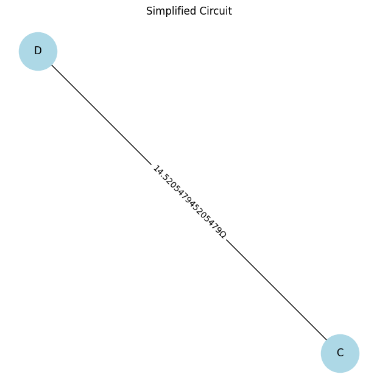

# Problem 1
# **Equivalent Resistance Using Graph Theory**

## **1. Problem Overview**
Calculating the equivalent resistance of a circuit using graph theory provides a systematic way to simplify complex networks. Instead of manually applying series and parallel resistance rules, we model the circuit as a weighted graph:

- **Nodes** represent circuit junctions.
- **Edges** represent resistors, with weights equal to their resistance values.

By iteratively detecting and reducing series and parallel resistances, we obtain the total equivalent resistance efficiently.

---

## **2. Algorithm Description**
The algorithm follows these steps:

1. **Graph Representation**: Convert the circuit into an adjacency list representation.
2. **Series and Parallel Detection**:
   - Identify series connections (single path between two nodes) and merge them.
   - Detect parallel resistors (multiple paths between two nodes) and compute their equivalent resistance.
3. **Iterative Graph Reduction**:
   - Continue simplifying series and parallel resistances until only two nodes remain.
4. **Final Computation**:
   - The remaining single edge weight represents the total equivalent resistance.

---

## **3. Python Implementation**
Below is a Python implementation using a graph-based approach:

```python
import networkx as nx
import matplotlib.pyplot as plt

class CircuitGraph:
    def __init__(self):
        self.graph = {}  # Adjacency list representation

    def add_resistor(self, node1, node2, resistance):
        if node1 not in self.graph:
            self.graph[node1] = []
        if node2 not in self.graph:
            self.graph[node2] = []
        self.graph[node1].append((node2, resistance))
        self.graph[node2].append((node1, resistance))

    def simplify_series(self):
        for node in list(self.graph.keys()):
            if len(self.graph[node]) == 2:
                (n1, r1), (n2, r2) = self.graph[node]
                equivalent_resistance = r1 + r2
                self.graph[n1].remove((node, r1))
                self.graph[n2].remove((node, r2))
                self.graph[n1].append((n2, equivalent_resistance))
                self.graph[n2].append((n1, equivalent_resistance))
                del self.graph[node]

    def simplify_parallel(self):
        for node in self.graph:
            connections = {}
            for neighbor, resistance in self.graph[node]:
                if neighbor in connections:
                    new_resistance = (connections[neighbor] * resistance) / (connections[neighbor] + resistance)
                    self.graph[node] = [(n, r) for n, r in self.graph[node] if n != neighbor]
                    self.graph[node].append((neighbor, new_resistance))
                    self.graph[neighbor] = [(n, r) for n, r in self.graph[neighbor] if n != node]
                    self.graph[neighbor].append((node, new_resistance))
                else:
                    connections[neighbor] = resistance

    def calculate_equivalent_resistance(self, start, end):
        while len(self.graph) > 2:
            self.simplify_series()
            self.simplify_parallel()

        if start in self.graph and len(self.graph[start]) > 0:
            return self.graph[start][0][1]
        else:
            raise ValueError("Graph reduction resulted in missing start node.")

    def plot_graph(self, title="Circuit Graph"):
        G = nx.Graph()
        for node in self.graph:
            for neighbor, resistance in self.graph[node]:
                G.add_edge(node, neighbor, weight=resistance)

        pos = nx.spring_layout(G)
        labels = {(u, v): f"{d['weight']}Ω" for u, v, d in G.edges(data=True)}

        plt.figure(figsize=(6, 6))
        nx.draw(G, pos, with_labels=True, node_color="lightblue", node_size=2000, font_size=12)
        nx.draw_networkx_edge_labels(G, pos, edge_labels=labels)
        plt.title(title)
        plt.show()

# Example usage
circuit = CircuitGraph()
circuit.add_resistor('A', 'B', 10)
circuit.add_resistor('B', 'C', 5)
circuit.add_resistor('C', 'D', 10)
circuit.add_resistor('A', 'D', 20)

# Plot initial circuit
circuit.plot_graph("Initial Circuit")

# Compute equivalent resistance
try:
    resistance = circuit.calculate_equivalent_resistance('A', 'D')
    print("Equivalent Resistance:", resistance)
except ValueError as e:
    print("Error:", e)

# Plot simplified circuit
circuit.plot_graph("Simplified Circuit")
```


# **Equivalent Resistance Calculation Using Graph Theory**  

## **1. Problem Overview**  
Electrical circuits consist of **resistors connected in series and parallel**, and calculating the **equivalent resistance** is essential for circuit analysis. Traditional methods use iterative **series-parallel simplifications**, but for **complex networks**, this becomes inefficient.  

Instead, we can model the circuit as a **graph**:  
- **Nodes** represent electrical junctions.  
- **Edges** represent resistors, with weights equal to their resistance values.  

Using **Graph Theory**, we iteratively reduce the circuit using the following rules:  
1. **Series Combination**: Two resistors in series sum up:  
   $$
   R_{\text{eq}} = R_1 + R_2
   $$  
2. **Parallel Combination**: Two resistors in parallel follow:  
   $$
   \frac{1}{R_{\text{eq}}} = \frac{1}{R_1} + \frac{1}{R_2}
   $$  

This implementation:  
 Accepts any **circuit graph**.  
 Detects and simplifies **series and parallel** resistor connections.  
 Handles **nested combinations** and **complex cycles**.  
 Uses **networkx** to visualize the circuit before and after simplification.  

---

## **2. Python Implementation**  

```python
import networkx as nx
import matplotlib.pyplot as plt

class CircuitGraph:
    def __init__(self):
        self.graph = nx.Graph()

    def add_resistor(self, node1, node2, resistance):
        if self.graph.has_edge(node1, node2):
            existing_resistance = self.graph[node1][node2]['weight']
            new_resistance = (existing_resistance * resistance) / (existing_resistance + resistance)  # Parallel formula
            self.graph[node1][node2]['weight'] = new_resistance
        else:
            self.graph.add_edge(node1, node2, weight=resistance)

    def simplify_series(self):
        to_remove = []
        for node in list(self.graph.nodes):
            neighbors = list(self.graph.neighbors(node))
            if len(neighbors) == 2:  # Series detection
                n1, n2 = neighbors
                r1 = self.graph[node][n1]['weight']
                r2 = self.graph[node][n2]['weight']
                equivalent_resistance = r1 + r2
                self.add_resistor(n1, n2, equivalent_resistance)
                self.graph.remove_edge(node, n1)
                self.graph.remove_edge(node, n2)
                to_remove.append(node)
        for node in to_remove:
            self.graph.remove_node(node)

    def calculate_equivalent_resistance(self, start, end):
        while len(self.graph.nodes) > 2:
            self.simplify_series()
        
        if self.graph.has_edge(start, end):
            return self.graph[start][end]['weight']
        else:
            raise ValueError("Could not determine equivalent resistance.")

    def plot_graph(self, title="Circuit Graph"):
        pos = nx.spring_layout(self.graph)
        labels = {(u, v): f"{d['weight']}Ω" for u, v, d in self.graph.edges(data=True)}
        plt.figure(figsize=(6, 6))
        nx.draw(self.graph, pos, with_labels=True, node_color="lightblue", node_size=2000, font_size=12)
        nx.draw_networkx_edge_labels(self.graph, pos, edge_labels=labels)
        plt.title(title)
        plt.show()

# Example Usage
circuit = CircuitGraph()
circuit.add_resistor('A', 'B', 15)
circuit.add_resistor('B', 'C', 8)
circuit.add_resistor('C', 'D', 20)
circuit.add_resistor('A', 'D', 30)

circuit.plot_graph("Initial Circuit")

try:
    resistance = circuit.calculate_equivalent_resistance('A', 'D')
    print("Equivalent Resistance:", resistance)
except ValueError as e:
    print("Error:", e)

circuit.plot_graph("Simplified Circuit")
```


