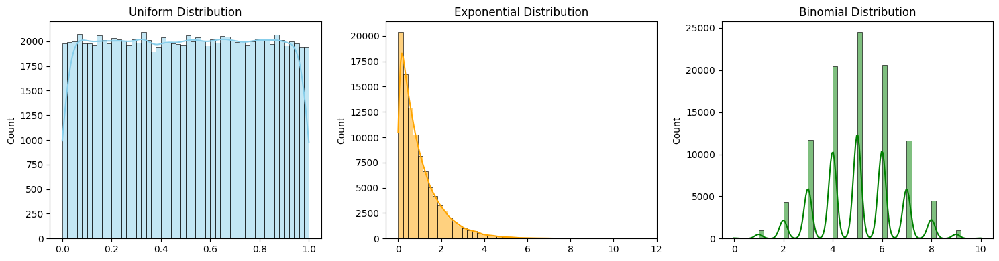

# Problem 1
# **1. Simulating Sampling Distributions**

## **Selected Population Distributions**

We'll use the following types:

- **Uniform Distribution** (e.g., between 0 and 1)
- **Exponential Distribution** (e.g., scale = 1.0)
- **Binomial Distribution** (e.g., $n = 10$, $p = 0.5$)

---

## **Python Code to Generate Populations**

```python
import numpy as np
import matplotlib.pyplot as plt
import seaborn as sns

# Set random seed for reproducibility
np.random.seed(42)

# Population sizes
pop_size = 100000

# Generate populations
uniform_pop = np.random.uniform(0, 1, pop_size)
exponential_pop = np.random.exponential(scale=1.0, size=pop_size)
binomial_pop = np.random.binomial(n=10, p=0.5, size=pop_size)

# Plot each distribution
plt.figure(figsize=(15, 4))

# Uniform
plt.subplot(1, 3, 1)
sns.histplot(uniform_pop, kde=True, bins=50, color='skyblue')
plt.title("Uniform Distribution")

# Exponential
plt.subplot(1, 3, 2)
sns.histplot(exponential_pop, kde=True, bins=50, color='orange')
plt.title("Exponential Distribution")

# Binomial
plt.subplot(1, 3, 3)
sns.histplot(binomial_pop, kde=True, bins=50, color='green')
plt.title("Binomial Distribution")

plt.tight_layout()
plt.show()
```
