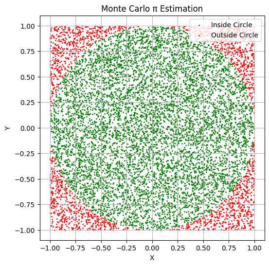
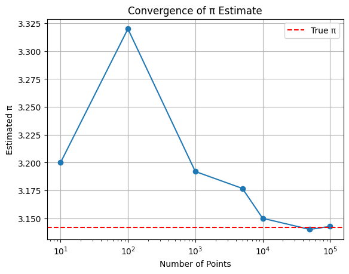

# Problem 2
# **Estimating π Using Monte Carlo – Circle Method**

---

## **1. Theoretical Foundation**

We estimate π by simulating points in a square and checking how many fall inside an inscribed circle.

- For a **unit circle** centered at the origin, any point $(x, y)$ lies inside the circle if:

$$
x^2 + y^2 \leq 1
$$

- The area of the full square is $4$ (from $[-1, 1] \times [-1, 1]$).
- The area of the unit circle is $π$.

The ratio of points inside the circle to the total points approximates the ratio of their areas:

$$
\frac{\text{Points in Circle}}{\text{Total Points}} \approx \frac{π}{4}
$$

Rearranging:

$$
π \approx 4 \cdot \frac{\text{Points in Circle}}{\text{Total Points}}
$$

---


## **2. Simulation – Estimating π**

```python
import numpy as np

def estimate_pi(num_points=10000):
    x = np.random.uniform(-1, 1, num_points)
    y = np.random.uniform(-1, 1, num_points)
    
    inside_circle = x**2 + y**2 <= 1
    pi_estimate = 4 * np.sum(inside_circle) / num_points
    return pi_estimate, x, y, inside_circle

# Example usage
pi, x_vals, y_vals, mask = estimate_pi(10000)
print(f"Estimated π ≈ {pi}")
```
Estimated π ≈ 3.1548


## **3. Visualization of Points**
```python
import matplotlib.pyplot as plt

def plot_points(x, y, inside_circle):
    plt.figure(figsize=(6,6))
    plt.scatter(x[inside_circle], y[inside_circle], s=1, color='green', label='Inside Circle')
    plt.scatter(x[~inside_circle], y[~inside_circle], s=1, color='red', label='Outside Circle')
    plt.gca().set_aspect('equal')
    plt.title("Monte Carlo π Estimation")
    plt.xlabel("X")
    plt.ylabel("Y")
    plt.legend()
    plt.grid(True)
    plt.show()

plot_points(x_vals, y_vals, mask)
```



## **4. Accuracy and Convergence**

### **Observing Convergencee**
```python
import matplotlib.pyplot as plt

sample_sizes = [10, 100, 1000, 5000, 10000, 50000, 100000]
estimates = []

for n in sample_sizes:
    pi_est, *_ = estimate_pi(n)
    estimates.append(pi_est)

plt.plot(sample_sizes, estimates, marker='o')
plt.axhline(np.pi, color='red', linestyle='--', label='True π')
plt.title("Convergence of π Estimate")
plt.xlabel("Number of Points")
plt.ylabel("Estimated π")
plt.legend()
plt.grid(True)
plt.xscale('log')
plt.show()
```
