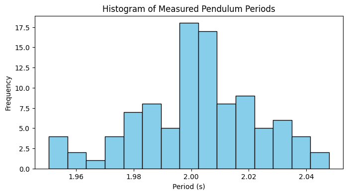
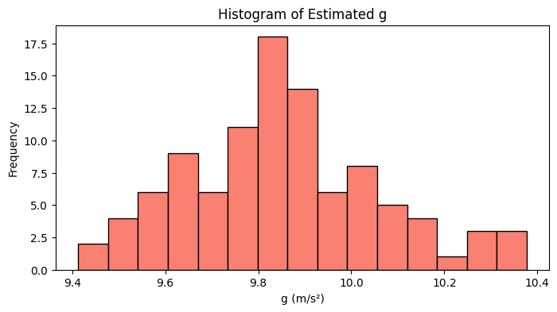
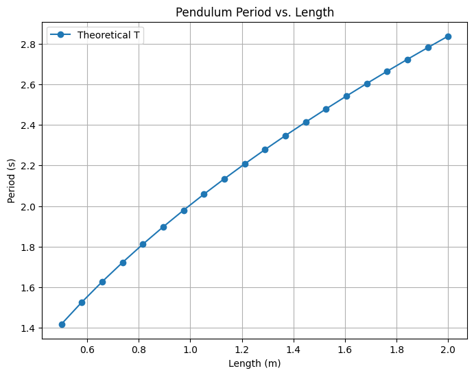

# Problem 1
# Measuring Earth's Gravitational Acceleration Using a Pendulum

## **1. Theoretical Foundation**

A simple pendulum (of small amplitude) has a period given by:

$$
T = 2\pi \sqrt{\frac{L}{g}}
$$

Where:
- $T$ is the period (time for one complete oscillation),
- $L$ is the length of the pendulum,
- $g$ is the acceleration due to gravity.

Rearranging the formula to solve for $g$, we obtain:

$$
g = \frac{4\pi^2 L}{T^2}
$$

This relation provides a straightforward method to measure $g$ by measuring $L$ and $T$.

---

## **2. Simulation**

The following Python code simulates the oscillations of a simple pendulum. It generates synthetic period data (with some random noise to mimic measurement errors) and then uses these periods to estimate $g$.

```python
import numpy as np
import matplotlib.pyplot as plt

# Pendulum parameters
L = 1.0         # Length in meters
g_true = 9.81   # True gravitational acceleration (m/s²)
T_true = 2 * np.pi * np.sqrt(L / g_true)  # Theoretical period

# Generate simulated period data with noise (simulate multiple trials)
num_trials = 100
# Adding normal noise with 0.02 sec standard deviation to mimic experimental error
measured_periods = T_true + np.random.normal(0, 0.02, num_trials)

# Estimate g from each measured period using: g = 4π²L/T²
g_estimates = 4 * np.pi**2 * L / measured_periods**2

# Compute average estimated g and standard deviation
g_mean = np.mean(g_estimates)
g_std = np.std(g_estimates)
print(f"Estimated g: {g_mean:.2f} m/s² ± {g_std:.2f} m/s²")
```
Estimated g: 9.85 m/s² ± 0.21 m/s²

## **3. Simulation**

### A. Histogram of Measured Periods
The histogram below shows the distribution of the measured periods:

```python
plt.figure(figsize=(8, 4))
plt.hist(measured_periods, bins=15, color='skyblue', edgecolor='black')
plt.title("Histogram of Measured Pendulum Periods")
plt.xlabel("Period (s)")
plt.ylabel("Frequency")
plt.show()
```



### B. Histogram of Estimated $g$ Values
The following plot visualizes how the estimated $g$ values are distributed:

```python
plt.figure(figsize=(8, 4))
plt.hist(g_estimates, bins=15, color='salmon', edgecolor='black')
plt.title("Histogram of Estimated g")
plt.xlabel("g (m/s²)")
plt.ylabel("Frequency")
plt.show()
```



### C. Period vs. Length Plot
To further verify the theoretical relationship, we can plot the period as a function of pendulum length:

```python
# Simulate for different pendulum lengths
lengths = np.linspace(0.5, 2.0, 20)  # Lengths from 0.5 m to 2.0 m
T_values = 2 * np.pi * np.sqrt(lengths / g_true)

plt.figure(figsize=(8, 6))
plt.plot(lengths, T_values, 'o-', label='Theoretical T')
plt.title("Pendulum Period vs. Length")
plt.xlabel("Length (m)")
plt.ylabel("Period (s)")
plt.legend()
plt.grid(True)
plt.show()
```



## **4. Analysis and Discussion**

Convergence:
As the number of trials increases, the average estimated $g$ converges to the true value (9.81 m/s²). The simulation demonstrates that even with measurement noise, averaging over many trials reduces the error.

Impact of Measurement Noise:
Small random errors in $T$ can lead to variability in the estimated $g$ due to the quadratic relationship in the formula. However, increasing the sample size reduces the uncertainty.

Assumptions and Limitations:

Small Angle Approximation: The formula $T = 2\pi \sqrt{\frac{L}{g}}$ assumes small oscillation angles. For larger angles, a correction is needed.

Neglected Factors: Air resistance and friction at the pivot are ignored, which in practice might affect the period slightly.

Practical Applications:
Measuring $g$ accurately is crucial in experimental physics and engineering—for calibrating instruments and understanding gravitational effects on structures. This pendulum method serves as an accessible, low-cost experiment for these purposes.